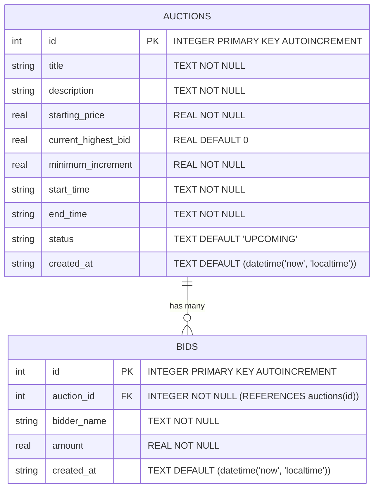

# Data Flow & ER Diagram Documentation

**Project Title:** Online Auction Bid Management System  
**Academic Domain:** Data Structures & Operating System Concepts  

---

## 1. Level 0 Data Flow Diagram (Context Diagram)

The Level 0 Data Flow Diagram depicts the boundary of the Online Auction System, showing how external entities (Bidders/Admins) interact with the application context.

```
                  ┌───────────────────────────┐
                  │    User / Bidder / Admin  │
                  └───────────────────────────┘
                    │                       ▲
                    │ 1. Create Auction     │ 4. Auction Details /
                    │ 2. Submit Bid         │    Bid Status /
                    │ 3. Run Simulation     │    Simulation Results
                    ▼                       │
          ┌───────────────────────────────────────────┐
          │                                           │
          │  ONLINE AUCTION BID MANAGEMENT SYSTEM     │
          │  (System Context Boundary)                │
          │                                           │
          └───────────────────────────────────────────┘
                    │                       ▲
                    │ Store / Read          │ Fetched State /
                    │ Auction & Bid Records │ Stored Data
                    ▼                       │
                  ┌───────────────────────────┐
                  │    SQLite Database        │
                  └───────────────────────────┘
```

---

## 2. Level 1 Data Flow Diagram (Detailed Data Flow)

The Level 1 Data Flow Diagram details the flow of data through internal processes: API Gateway Routing, Java Lock Acquisition, Priority Queue Manipulation, and SQLite Persistence.

```
 [User/Browser] 
       │
       │ (HTTP Request: Bid Payload)
       ▼
 [1.0 Route & Validate Request] (Flask auction_routes.py)
       │
       │ (JSON Data)
       ▼
 [2.0 Bridge Request] (java_bridge.py)
       │
       │ (HTTP POST /place-bid)
       ▼
 [3.0 Acquire Critical Lock] (Java ConcurrencyManager.java)
       │
       │ (Exclusive Lock Granted)
       ▼
 [4.0 Read State & Validate Rules] (AuctionManager.java)
       │
       ├─── IF Valid Bid ─────────────────────────────┐
       │                                              │
       ▼                                              ▼
 [5.0 Insert into PriorityQueue]              [Reject Response]
 (BidPriorityQueue.java - O(log n))                   │
       │                                              │
       │ (Updated Queue Peak)                         │
       ▼                                              │
 [6.0 Release Critical Lock]                          │
 (ConcurrencyManager.unlock())                        │
       │                                              │
       ▼                                              │
 [7.0 Persist Accepted Bid to Database] <─────────────┘
 (SQLite db.py: INSERT into bids & UPDATE auctions)
       │
       ▼
 [8.0 Format Response & Render UI] (JS Client)
```

---

## 3. Concurrent Bidding Path Data Flow

When executing a concurrent bid simulation from `demo.html`:

```
 [Client UI / Demo] ── (bidders array: [{name: "Bidder-1", amount: 10500}, ...]) ──► [Flask /api/auctions/1/simulate-concurrent-bids]
                                                                                               │
                                                                                               ▼
                                                                                   [Java Engine /simulate-concurrent-bids]
                                                                                               │
                                                                                               ▼
                                                                                   [ConcurrentBidSimulation.runSimulation]
                                                                                               │
                                            ┌──────────────────────────────────────────────────┴──────────────────────────────────────────────────┐
                                            │                                                                                                    │
                                            ▼                                                                                                    ▼
                                  [Thread 1: BidderThread]                                                                             [Thread 2: BidderThread]
                                            │                                                                                                    │
                                            ▼                                                                                                    ▼
                               [concurrencyManager.lock()]                                                                          [concurrencyManager.lock()]
                                (Blocks if held by T2)                                                                               (Blocks if held by T1)
                                            │                                                                                                    │
                                            ▼                                                                                                    ▼
                              [AuctionManager.placeBid()]                                                                          [AuctionManager.placeBid()]
                                            │                                                                                                    │
                                            ▼                                                                                                    ▼
                               [concurrencyManager.unlock()]                                                                        [concurrencyManager.unlock()]
                                            │                                                                                                    │
                                            └──────────────────────────────────────────────────┬──────────────────────────────────────────────────┘
                                                                                               │
                                                                                               ▼
                                                                                [Thread Barrier: Thread.join()]
                                                                                               │
                                                                                               ▼
                                                                                [Collect Summary Results & Persist]
```

---

## 4. Entity-Relationship (ER) Diagram

### ER Diagram (Mermaid)



### Database Schema Specifications

#### Table: `auctions`
| Column Name | Data Type | Constraints | Description |
| :--- | :--- | :--- | :--- |
| `id` | `INTEGER` | `PRIMARY KEY AUTOINCREMENT` | Unique identifier for each auction item. |
| `title` | `TEXT` | `NOT NULL` | Name of the auction item. |
| `description` | `TEXT` | `NOT NULL` | Detailed description of item condition and specifications. |
| `starting_price` | `REAL` | `NOT NULL` | Initial starting price in INR ($\text{₹}$). |
| `current_highest_bid` | `REAL` | `DEFAULT 0` | Current highest accepted bid amount. |
| `minimum_increment` | `REAL` | `NOT NULL` | Minimum required increase for subsequent bids. |
| `start_time` | `TEXT` | `NOT NULL` | Scheduled start datetime (`%Y-%m-%d %H:%M:%S`). |
| `end_time` | `TEXT` | `NOT NULL` | Scheduled end datetime (`%Y-%m-%d %H:%M:%S`). |
| `status` | `TEXT` | `DEFAULT 'UPCOMING'` | Calculated auction status (`UPCOMING`, `ACTIVE`, `ENDED`). |
| `created_at` | `TEXT` | `DEFAULT (datetime('now'))` | Timestamp when auction was created in DB. |

#### Table: `bids`
| Column Name | Data Type | Constraints | Description |
| :--- | :--- | :--- | :--- |
| `id` | `INTEGER` | `PRIMARY KEY AUTOINCREMENT` | Unique identifier for each bid. |
| `auction_id` | `INTEGER` | `NOT NULL, FOREIGN KEY (auctions.id)` | Parent auction ID referenced by foreign key. |
| `bidder_name` | `TEXT` | `NOT NULL` | Name of user placing bid. |
| `amount` | `REAL` | `NOT NULL` | Offered bid amount in INR ($\text{₹}$). |
| `created_at` | `TEXT` | `DEFAULT (datetime('now'))` | Timestamp when bid was placed. |
