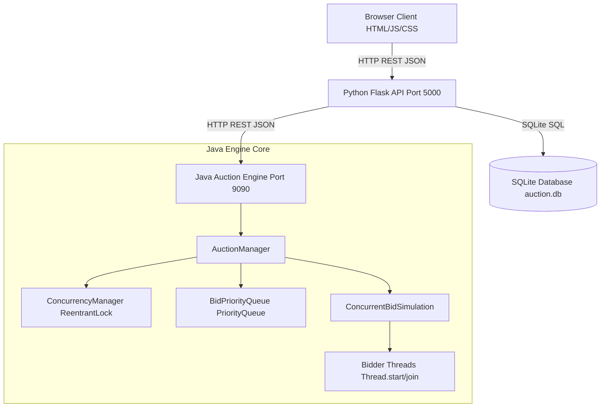
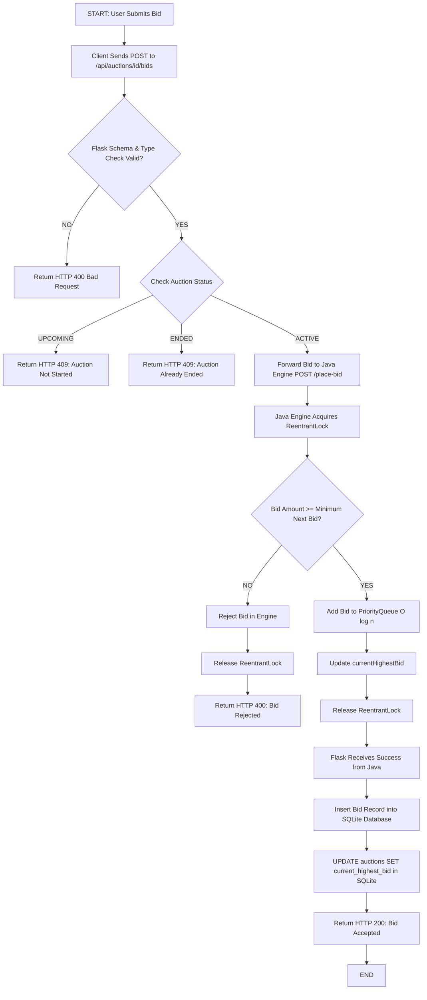
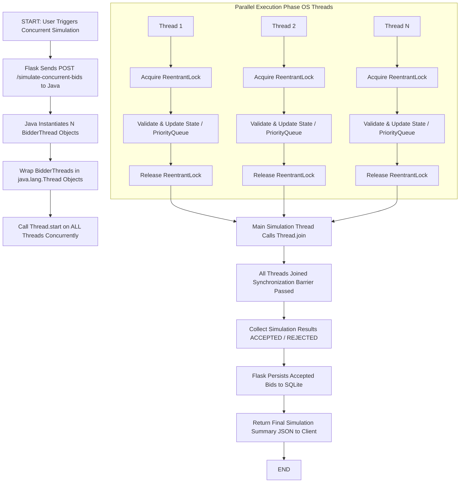

# System Architecture & Flowcharts

**Project Title:** Online Auction Bid Management System  
**Academic Domain:** Data Structures & Operating System Concepts  

---

## 1. High-Level System Architecture

The Online Auction Bid Management System uses a decoupled, three-tier architecture comprising a web-based presentation layer, a Python Flask REST API gateway, an authoritative Java concurrency & Priority Queue engine, and an SQLite relational database.

```
┌─────────────────────────────────────────────────────────────────┐
│                      CLIENT / PRESENTATION                      │
│   HTML5 / Vanilla CSS / JavaScript (Fetch API - Client App)    │
│   (index.html, auction.html, admin.html, demo.html, about.html)  │
└─────────────────────────────────────────────────────────────────┘
                                │
                                │ HTTP REST (JSON)
                                ▼
┌─────────────────────────────────────────────────────────────────┐
│                     API GATEWAY / BACKEND                       │
│                   Python Flask Server (Port 5000)               │
│   - Route Blueprint (auction_routes.py)                         │
│   - Java Bridge HTTP Service (java_bridge.py)                   │
│   - Database Layer (db.py)                                      │
└─────────────────────────────────────────────────────────────────┘
                   │                               │
    Database SQL   │                               │ HTTP REST (JSON)
    Read / Write   ▼                               ▼ Port 9090
┌──────────────────────┐             ┌────────────────────────────┐
│   SQLite DATABASE    │             │    JAVA AUCTION ENGINE     │
│   (auction.db)       │             │   (com.sun.net.httpserver) │
│ - auctions table     │             │ - AuctionManager.java      │
│ - bids table         │             │ - ConcurrencyManager.java  │
└──────────────────────┘             │   (ReentrantLock)          │
                                     │ - BidPriorityQueue.java    │
                                     │   (PriorityQueue<Bid>)     │
                                     │ - ConcurrentBidSimulation  │
                                     │   (BidderThreads)          │
                                     └────────────────────────────┘
```

### Mermaid Architecture Diagram



---

## 2. Tier Responsibilities

### 2.1 Presentation Tier (Frontend)
- **Files:** `frontend/index.html`, `frontend/auction.html`, `frontend/admin.html`, `frontend/demo.html`, `frontend/about.html`, `frontend/js/*.js`, `frontend/css/style.css`.
- **Responsibilities:**
  - Provides responsive, accessible views for browsing auctions, placing manual bids, executing concurrent thread simulations, and viewing the live Priority Queue.
  - Communicates asynchronously with the Flask API via `api.js` using `fetch()`.

### 2.2 Application / Gateway Tier (Python Flask)
- **Files:** `python-backend/app.py`, `python-backend/routes/auction_routes.py`, `python-backend/services/java_bridge.py`.
- **Responsibilities:**
  - Exposes RESTful endpoints on `http://localhost:5000/api`.
  - Performs initial schema validation, type checking, and boundary validation.
  - Bridges requests to the Java Auction Engine running on `http://localhost:9090`.
  - Persists accepted auction metadata and bid records into SQLite.
  - On startup (`sync_auctions_to_java()`), reconstructs auction state in the Java engine from SQLite records.

### 2.3 Concurrency & Data Structure Engine (Java Engine)
- **Files:** `java-engine/src/engine/*.java`.
- **Responsibilities:**
  - Serves HTTP requests via built-in `com.sun.net.httpserver.HttpServer` on port 9090 with a 10-thread fixed pool (`Executors.newFixedThreadPool(10)`).
  - Enforces thread safety over critical sections using `ReentrantLock` in `ConcurrencyManager.java`.
  - Maintains `BidPriorityQueue` (binary heap) for $O(1)$ peek retrieval of winning bids and $O(\log n)$ insertion.
  - Executes multi-threaded simulation of concurrent bidders via `BidderThread` objects running on real OS threads.

### 2.4 Database Tier (SQLite)
- **Files:** `python-backend/database/db.py`, `python-backend/database/auction.db`.
- **Responsibilities:**
  - Relational storage for `auctions` and `bids` tables.
  - Enforces foreign key constraints (`PRAGMA foreign_keys = ON`).

---

## 3. Flowcharts

### 3.1 Normal Bidding Flowchart



### 3.2 Concurrent Bidding Flowchart (Multithreaded Execution)


